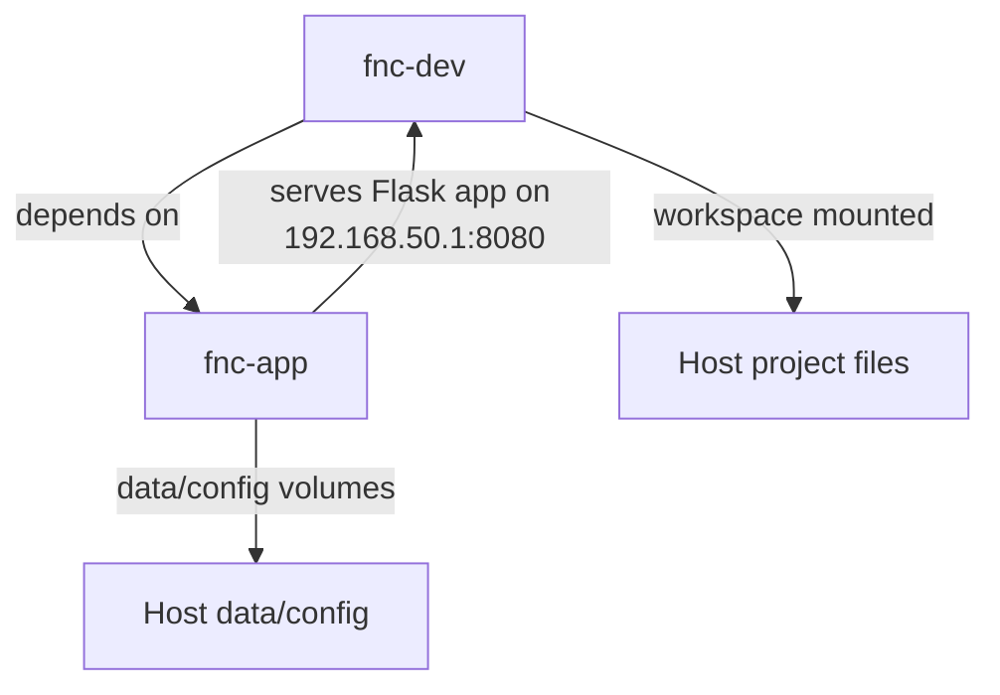

# Development Environment

This project includes a dev container setup for consistent development across different machines, with support for Docker container runtimes.

## Quick Start

1. **Using Workspace File**: Open `field-network-checker.code-workspace` in VS Code
2. **Choose Runtime**: VS Code will prompt you to select a dev container configuration

## Manual Setup

1. Install VS Code and the "Dev Containers" extension in a remote ssh host
2. Install either Docker on the remote system
3. Open the project in VS Code

## Usage

Once in the dev container:

- **Run Tests**: Ctrl+Shift+P → "Tasks: Run Task" → "Run Tests"
- **Run tests manually**: `python app/run_tests.py` or `pytest app/tests/test_app_unit.py`
- **Install Dependencies**: Ctrl+Shift+P → "Tasks: Run Task" → "Install Dependencies"
- **Run App**: Ctrl+Shift+P → "Tasks: Run Task" → "Run App"

## Architecture

- `fnc-app`: production application container that runs the Flask service
- `fnc-dev`: development container with full workspace access and the VS Code attached environment
- Both containers are launched together so the dev container can use the app container as its dependency

## Requirements

- **Docker**: Docker Engine installed and running

## Files

- `field-network-checker.code-workspace`: VS Code workspace file with default Docker settings
- `.devcontainer/devcontainer.json`: Docker dev container configuration
- `.devcontainer/docker-compose.dev.yaml`: Development service definition
- `.vscode/tasks.json`: VS Code tasks for common operations
- `.vscode/settings.json`: Default VS Code settings (can be overridden)