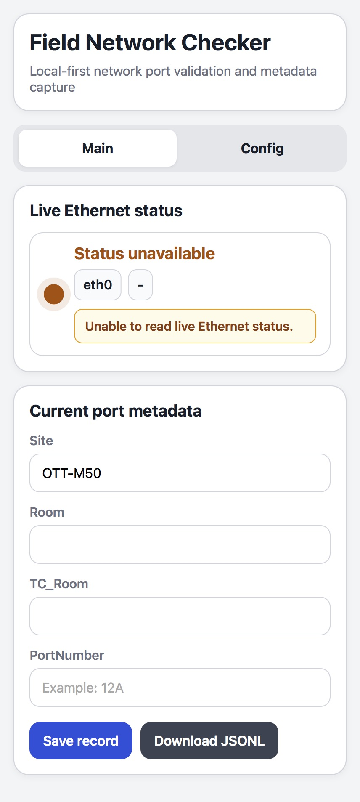

<p align="center">
  
</p>

# Field Network Checker

Field Network Checker is a local-first tool for validating unknown Ethernet ports in the field and capturing port metadata at the time of testing.

## Why this project exists

In buildings with mixed network environments, a live wall port does not tell you enough on its own. Staff need a fast way to answer a few practical questions on site:

- Is the link up or down?
- Did DHCP assign an address?
- Does the assigned address match the target legacy network pattern?
- What room and port did I test?

This project turns those checks into a small, direct workflow with immediate visual feedback and local record capture.

## What it does

- Monitors live Ethernet status
- Shows link down, status unavailable, link up with no IP, link up on a non-target network, and link up on the target legacy network
- Highlights target-network detection from the assigned IP
- Captures site, room, telecom room, and port number
- Saves records locally and exports JSONL for later consolidation

## Why local-first matters

The tool is designed for field work. It stays useful even before any central system integration. It gives the technician an immediate answer at the wall jack, then preserves the metadata for later import or reporting.

`Link down` means there is no active Ethernet link. `Status unavailable` means the device could not read live status from the host at that moment, so the operator should retry or check the device state instead of assuming the wall port is down.

## Interface preview

### Link down


### Link up, no IP yet


### Link up, non-target network


### Link up, target legacy network


### Status unavailable


When the app shows `Status unavailable`, it means the device could not read live Ethernet or IP status from the host and the operator should retry or check the device before treating the port as down.

## Public project page

[Open the Field Network Checker project page](https://patrickpaul-perso.github.io/field-network-checker/)

## Current implementation status

The repository now includes the main pieces needed for a host-managed proof of concept on Raspberry Pi:

- Ansible roles for `base`, `docker`, `network_ap`, and `app`
- a Docker Compose deployment for the Flask application
- a lean runtime tree under `/opt/field-network-checker` for `data` and `config`
- local data and config directories for persistent records and defaults
- unit tests for core app behavior

The `app` role is intended to create only the minimum host runtime tree under `/opt/field-network-checker`, seed the default config when missing, and start `fnc-app` with Docker Compose from the checked-out repository on the host.

The intended privilege model is:

- run `ansible-playbook` as a regular user from the checked-out repository on the Pi
- let Ansible use privilege escalation only for OS-level tasks such as package install, service management, NetworkManager changes, and creating `/opt/field-network-checker`
- keep the runtime tree under `/opt/field-network-checker` owned by the user who launched `ansible-playbook`
- build and run Docker Compose from the checked-out Git repository on the Pi instead of copying deployment files into `/opt/field-network-checker`
- run the Flask application container as a regular user, while still keeping the `SYS_TIME` capability for time-setting behavior

## Host deployment notes

The intended host model is:

- Raspberry Pi OS on the device
- local Ansible execution against `localhost`
- Ansible run from the checked-out repository on the Pi, wherever the repo was cloned
- NetworkManager-managed hotspot setup for the field access point
- Docker Compose for the web app runtime
- `/opt/field-network-checker` as the host runtime directory

The main host-side playbook is [ansible/site.yml](ansible/site.yml), and the current app deployment tasks live in [ansible/roles/app/tasks/main.yml](ansible/roles/app/tasks/main.yml).

## Host test flow

These are the main commands intended for validation on the Raspberry Pi host:

```bash
cd /path/to/field-network-checker
ansible-playbook ansible/site.yml --syntax-check
ansible-playbook ansible/site.yml --tags app
docker compose -f deploy/compose.yaml ps
docker logs fnc-app --tail 50
curl http://192.168.50.1:8080/api/status
```

The Ansible commands above run from the repository checkout on the Pi. Only the deployed runtime state lives under `/opt/field-network-checker`. After deployment, Docker inspection can be done with `docker ps`, `docker logs fnc-app --tail 50`, or `docker compose -f deploy/compose.yaml ps` from the repository checkout.

## Status

Prototype and presentation-ready proof of concept.
