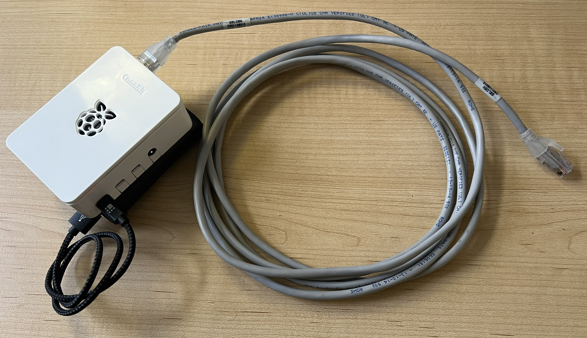
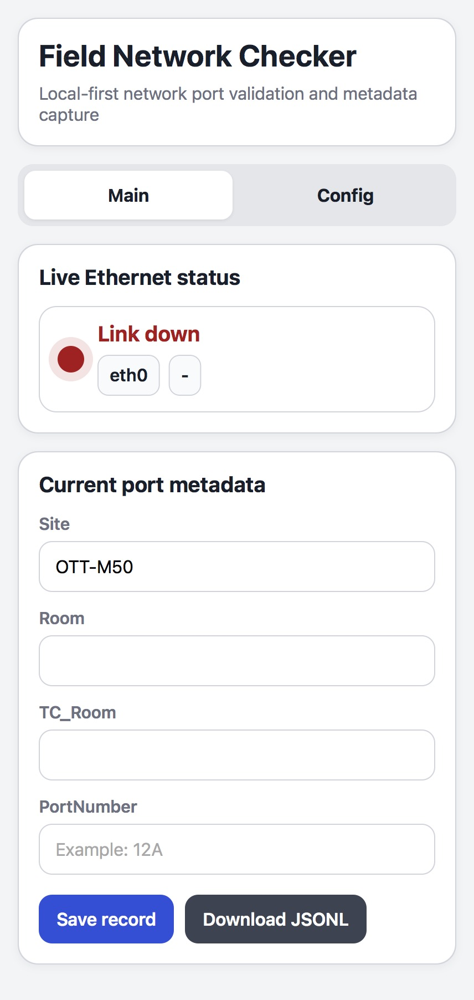
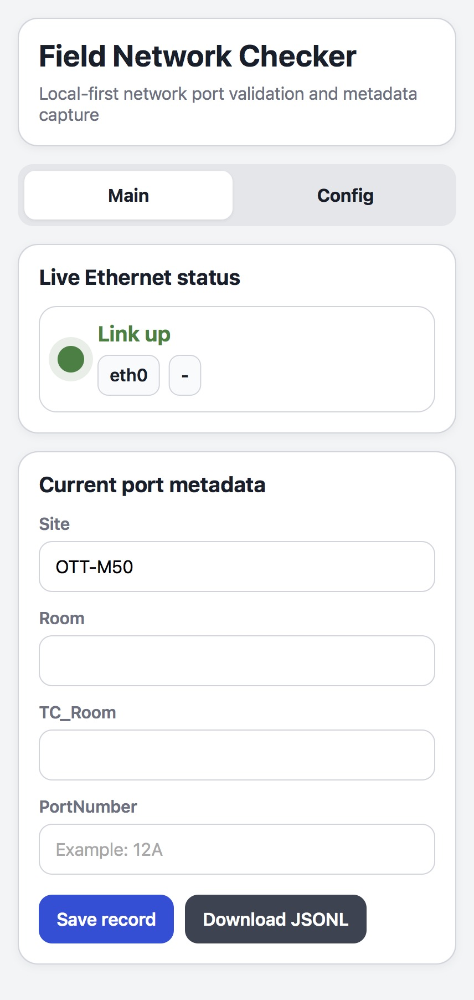
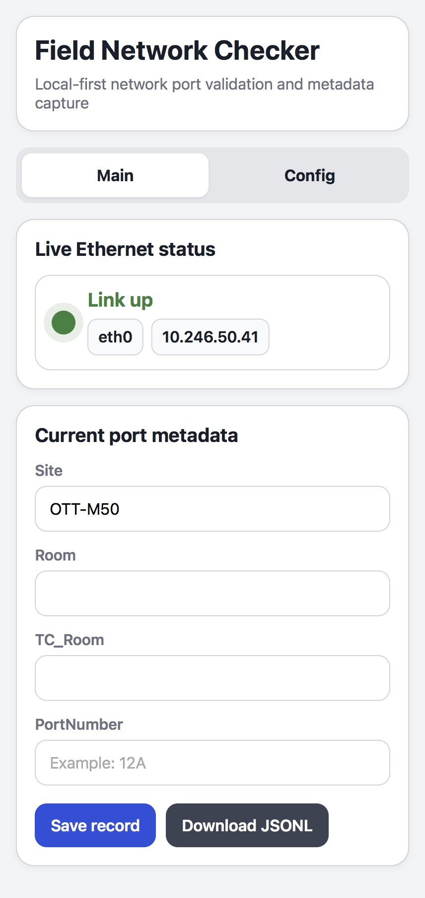
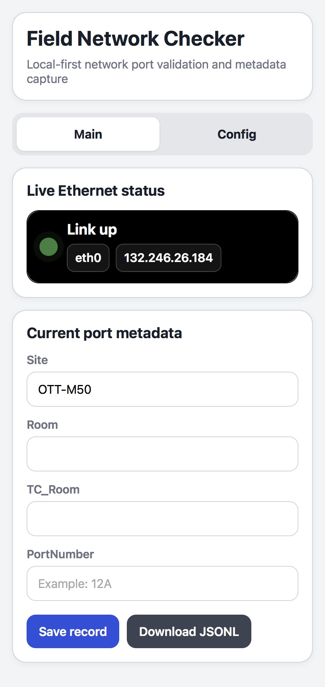

  

# Field Network Checker

Field Network Checker is a local-first tool for validating unknown Ethernet ports in the field and capturing port metadata at the time of testing.

## Why this project exists

In buildings with mixed network environments, a live wall port does not tell you enough on its own. Staff need a fast way to answer a few practical questions on site:

- Is the link up or down?
- Did DHCP assign an address?
- Does the assigned address match the target legacy network pattern?
- What room and port did I test?

This project turns those checks into a small, direct workflow with immediate visual feedback and local record capture.

## What it does

- Monitors live Ethernet status
- Shows link down, link up with no IP, link up on a non-target network, and link up on the target legacy network
- Highlights target-network detection from the assigned IP
- Captures site, room, telecom room, and port number
- Saves records locally and exports JSONL for later consolidation

## Why local-first matters

The tool is designed for field work. It stays useful even before any central system integration. It gives the technician an immediate answer at the wall jack, then preserves the metadata for later import or reporting.

## Interface preview

### Link down

### Link up, no IP yet

### Link up, non-target network

### Link up, target legacy network

## Public project page

See the project site in the `docs/` folder once GitHub Pages is enabled.

## Status

Prototype and presentation-ready proof of concept.