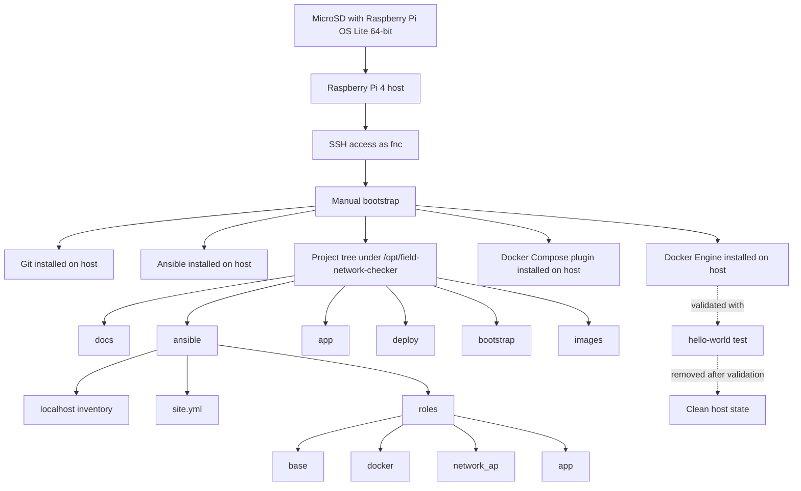

# Milestone 1, Manual Bootstrap Summary

## Purpose

This milestone established the minimum host-side foundation required to continue building Field Network Checker, or FNC.

The goal of this phase was to:

- boot a clean Raspberry Pi OS system
- gain remote access over SSH
- install the minimum host tools needed to manage the rest of the platform
- prepare a self-contained project structure for source control, Ansible, Docker, and documentation

This phase intentionally stopped before configuring the local access point, the containerized web application, or the data capture workflow.

## Current Status

The Raspberry Pi was successfully:

- written with Raspberry Pi OS Lite 64-bit
- booted on a normal physical network
- reached over SSH using the local account `fnc`
- prepared with the minimum packages needed for local automation and container deployment

The temporary Docker validation artifacts created by the `hello-world` test were also removed afterward.

## Manual Steps Completed

### 1. Wrote the OS image

The SD card was written using Raspberry Pi Imager with a minimal configuration.

Configured during imaging:

- username: `fnc`
- initial password: set during imaging
- SSH: enabled
- Wi-Fi client settings: left blank

The `fnc` username is a required bootstrap convention for this project. It keeps first boot simple, avoids preconfiguring network behavior that will later be managed by the project itself, and lets the local Ansible playbooks assume a stable non-root account exists for post-install host setup.

### 2. Booted the Raspberry Pi on a normal Ethernet network

For the first startup, the Raspberry Pi was connected to a standard local network through its physical Ethernet port.

This provided:

- DHCP address assignment
- easy SSH access
- a clean environment for the initial bootstrap

### 3. Connected over SSH

The Raspberry Pi was accessed remotely using the initial local account.

Example login form:

    ssh fnc@<ip-address>

### 4. Installed the minimum host packages

## Manual prerequisite before running Ansible

Set the Wi-Fi regulatory country on the Raspberry Pi host.

```bash
sudo raspi-config nonint do_wifi_country CA
sudo reboot
```

After reboot the first host packages installed were:

```bash
sudo apt update
sudo apt upgrade
sudo apt install -y git ansible ca-certificates curl tree
```

This setup assumes the OS image was installed with a local user account named `fnc`. That account is the expected first-login and automation user for Milestone 1, and the Ansible configuration uses it by default when applying host-level changes such as Docker group membership.

These provide the minimum support needed to:

- clone and manage the project repository
- run Ansible locally on `localhost`
- add external package repositories safely
- inspect the project directory structure during setup

### 5. Ran Ansible base and docker roles

With Ansible installed, run the base and docker roles to install Docker and add the `fnc` user to the `docker` group:

```bash
cd field-network-checker
ansible-playbook ansible/site.yml --tags base,docker
```

This automates the Docker installation from the official repository and the expected `fnc` user setup.

### 6. Validated Docker installation

A basic Docker validation was performed using the `hello-world` image.

A basic Docker validation was performed using the `hello-world` image.

After confirming that Docker worked correctly, the temporary validation image and container were removed. This kept the host tidy and avoided leaving non-project runtime artifacts behind.

### 7. Created the local project structure

A self-contained project root was created under `/opt/field-network-checker`.

This structure is designed to keep the solution self-contained and portfolio-friendly.

### 8. Prepared local Ansible execution

The project was set up so Ansible runs directly on the Raspberry Pi against `localhost`.

This avoids the need for a separate controller machine and keeps the repository self-contained.

The local inventory model is based on:

    localhost ansible_connection=local ansible_python_interpreter=/usr/bin/python3

### 9. Added the initial playbook structure

A top-level Ansible playbook was created to organize the project into clear functional roles:

- `base`
- `docker`
- `network_ap`
- `app`

At this stage, the `base` role contains the first actual task, which installs `tree` using an Ansible package list with a single element.

## Architecture at the End of Milestone 1



## Host Responsibilities Defined So Far

The host currently owns only the minimum required responsibilities:

- operating system
- SSH access
- Git repository checkout
- local Ansible execution
- Docker runtime
- future host-side wireless access point configuration

This remains aligned with the design goal of keeping the host minimal while moving most project logic into containers later.

## What Is Not Done Yet

The following items are still out of scope for this milestone:

- configuring `wlan0` as a local access point
- defining the host network profile for offline field use
- creating the containerized web application
- reading link and IP state from the field interface
- writing `records.jsonl`
- exporting CSV from JSONL
- adding an admin page
- archiving and reset actions

## Next Step

The next logical step is to continue with the Ansible roles in this order:

1. `base`
2. `docker`
3. `network_ap`
4. `app`

The immediate technical target is to move from a manually bootstrapped host to a reproducible local Ansible run that configures the remaining platform components.

## Notes

This milestone is intentionally simple.

The objective was not to build a finished product, but to establish a clean, reproducible base for the first working proof of concept.
